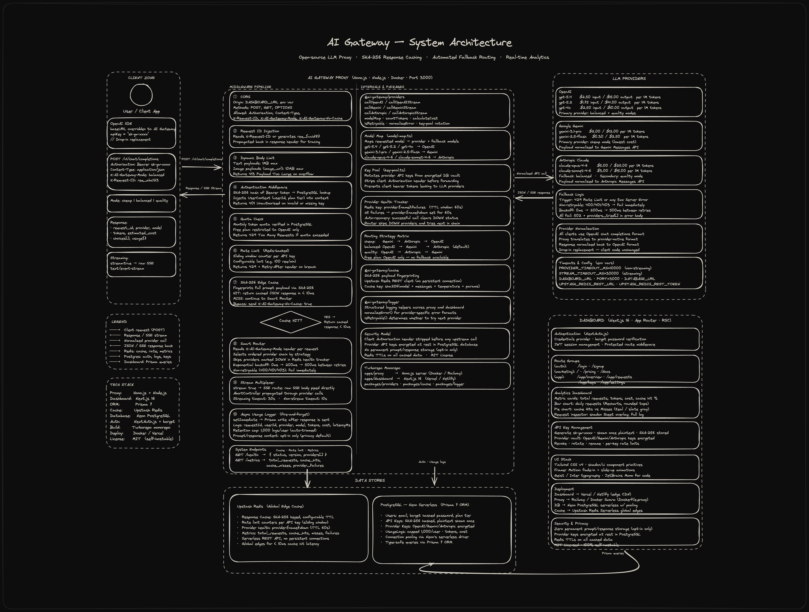
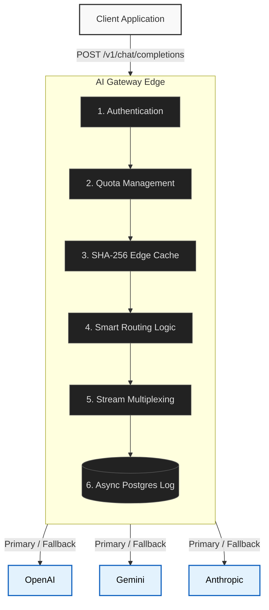

# AI Gateway

Open-source LLM proxy with **semantic response caching**, automated fallback routing, and real-time usage analytics.

AI Gateway acts as an invisible interception layer between your application and Large Language Model providers (OpenAI, Gemini, Anthropic). By caching semantically similar prompt responses (not just exact matches) and intelligently routing requests when rate limits are hit, it dramatically reduces API costs and ensures absolute uptime — all without requiring any architectural changes to your existing codebase.


## Open Source & Self-Hostable

This project is built for the community. It is 100% free, MIT-licensed, and designed from the ground up to be self-hosted on your own infrastructure. You maintain absolute control over your API keys, your prompt data, and your caching logic. There are no usage-based fees and no telemetry phoning home.

---

## Why AI Gateway?

Modern AI applications face three critical challenges in production:

1. **Unnecessary Costs:** Sending the exact same prompt to OpenAI multiple times burns token budgets.
2. **Provider Instability:** Entire product workflows break down when a single AI provider experiences an outage or invokes rate limits.
3. **Vendor Lock-in:** Transitioning an application built entirely on the OpenAI SDK over to Gemini or Anthropic requires extensive refactoring.

AI Gateway solves all three instantly through a single unified endpoint.

---

## Core Features

- **Hybrid Response Caching (Exact + Semantic):** Two-layer caching pipeline. First, an exact SHA-256 fingerprint match (< 1ms — zero LLM call). Second, if no exact match, a semantic vector similarity search via Upstash Vector (< 20ms) — so paraphrased prompts like "What is 2+2?" and "2+2 =?" both hit the cache. Eliminates redundant API calls and dramatically cuts costs even for conversational workloads.
- **Automated Fallback Routing:** If your primary provider (e.g., OpenAI) responds with a 429 Rate Limit or 500 Server Error, the proxy seamlessly reroutes the exact payload to a configured secondary provider (e.g., Gemini or Anthropic Claude) completely invisibly to your client.
- **Smart Routing Strategies:** Inject headers to dynamically route traffic per-request based on strategy (`cheap`, `balanced`, `quality`).
- **Analytics & Cost Dashboard:** Real-time visibility into token usage, cost breakdowns per provider, and cache-hit ratios.
- **Per-Key Rate Limiting:** Secure your endpoints from abuse with strict, Redis-backed rate limits configurable per gateway API key (e.g., 100 req/min).

---

## System Architecture

The gateway operates on a high-throughput, horizontally scalable stateless architecture. The diagram below shows the complete request lifecycle — from client to LLM provider — including all middleware layers, caching, fallback routing, data stores, and the analytics dashboard.



> **Full system design** showing the complete middleware pipeline (① CORS → ② Request ID → ③ Body Limit → ④ Auth → ⑤ Quota → ⑥ Rate Limit → ⑦ SHA-256 Cache → ⑧ Smart Router → ⑨ Stream Multiplexer → ⑩ Async Logger), provider health tracking, fallback routing strategy matrix, Upstash Redis and Neon PostgreSQL data stores, and the Next.js analytics dashboard.

### Request Flow Overview



At its core, the proxy acts as a reverse proxy multiplexer. It standardizes outgoing payloads, evaluates them against the Upstash Redis Edge cache, and if an identical prompt signature is not found, dynamically routes the request upstream based on the current active routing policy.

---

## Privacy and Security

Security is enforced at the network, application, and database levels:

- **Zero Data Retention:** Prompts and responses are temporarily cached in Redis (with strict TTLs) purely for deduplication. They are never stored permanently unless explicitly configured for logging.
- **Provider Key Encryption:** Root API keys for downstream providers (OpenAI, Anthropic, Gemini) are deeply encrypted at rest within the PostgreSQL database.
- **Client Key Isolation:** Client gateway keys are generated cleanly, hashed via SHA-256 for storage, and displayed in plaintext only once.
- **Strict Network Management:** The proxy automatically strips sensitive client authorization headers before forwarding payloads to external LLM providers, ensuring bearer tokens do not leak upstream.

---

## Technology Stack

| Component          | Technology        | Description                                                                       |
| :----------------- | :---------------- | :-------------------------------------------------------------------------------- |
| **Proxy Engine**   | `Hono`            | Node.js / Edge compatible framework for sub-10ms overhead routing.                |
| **Dashboard**      | `Next.js 16`      | App Router with React Server Components for the UI and Docs.                      |
| **Styling**        | `Tailwind CSS v4` | Combined with custom `shadcn/ui` primitives for an enterprise aesthetic.          |
| **Database**       | `PostgreSQL`      | Neon Serverless via connection pooling, accessed via `Prisma 7` ORM.              |
| **Caching Layer**  | `Upstash Redis`   | Global REST API for exact-match response serving and rate limiting architectures. |
| **Authentication** | `NextAuth.js`     | Combined with `bcrypt` cryptographic hashing for secure session management.       |

---

## Quick Start (Local Setup)

Deploying a local instance of the proxy and dashboard takes under 5 minutes.

```bash
# Clone the repository
git clone https://github.com/your-org/ai-gateway.git
cd ai-gateway

# Copy environment variables
cp .env.example .env

# Configure your .env file with your Database, Upstash, and Provider Keys

# Deploy the entire stack using Docker Compose
docker compose up -d
```

---

## Drop-in SDK Integration

The AI Gateway mirrors the OpenAI API specification exactly. To integrate it into your existing application, simply override the base URL and point your API key to the gateway.

```javascript
import OpenAI from "openai";

const openai = new OpenAI({
  baseURL: "https://your-gateway.example.com/v1",
  apiKey: "sk-gw-xxxxxxxxx", // Your AI Gateway key
});

// The payload remains identical, regardless of the target provider
const response = await openai.chat.completions.create({
  model: "gpt-5.2", // OR: gemini-2.5-flash, claude-sonnet-4-6
  messages: [{ role: "user", content: "Optimize this payload." }],
});
```

---

## Smart Routing Strategies

For production workloads, fallback and smart routing can be dynamically configured per-request by passing the `X-AI-Gateway-Mode` header.

- **`balanced` (Default):** Attempts the primary requested model first, falling back to an equivalent tier on another provider if rate limits or 500 errors occur.
- **`cheap`:** Intercepts the request and forces execution on the cheapest available model (e.g., Gemini Flash), regardless of the model designated in the payload. Ideal for non-critical bulk tasks.
- **`quality`:** Forces execution through the highest logic tier (e.g., GPT-4o or Claude Opus), overriding cost-saving preferences.

```javascript
// Example implementation
const response = await fetch(
  "https://your-gateway.example.com/v1/chat/completions",
  {
    method: "POST",
    headers: {
      Authorization: "Bearer sk-gw-xxxx",
      "Content-Type": "application/json",
      "X-AI-Gateway-Mode": "cheap",
    },
    body: JSON.stringify(payload),
  },
);
```

---

## Supported Models Portfolio (March 2026)

| Model               | Provider  | Input $/1M | Output $/1M |
| ------------------- | --------- | ---------- | ----------- |
| `gpt-5.4`           | OpenAI    | $2.50      | $15.00      |
| `gpt-5.2`           | OpenAI    | $1.75      | $14.00      |
| `gpt-4o`            | OpenAI    | $2.50      | $10.00      |
| `gemini-3.1-pro`    | Gemini    | $2.00      | $12.00      |
| `gemini-2.5-flash`  | Gemini    | $0.30      | $2.50       |
| `claude-opus-4-6`   | Anthropic | $5.00      | $25.00      |
| `claude-sonnet-4-6` | Anthropic | $3.00      | $15.00      |

_Pricing is subject to change at the provider level._

---

## Deployment Recommendations

For production environments, the following architecture is recommended to separate concerns and guarantee performance:

- **Proxy API Server:** Railway or Docker Swarm (Dockerfile deployment).
- **Dashboard GUI:** Vercel or Netlify (Direct repository connection).
- **Database Engine:** Neon PostgreSQL (Ensure connection pool URLs are utilized).
- **Cache Engine:** Upstash Redis Serverless.

---

## License

This project is licensed under the MIT License. You are free to self-host, alter, and distribute the repository for both commercial and non-commercial purposes.
